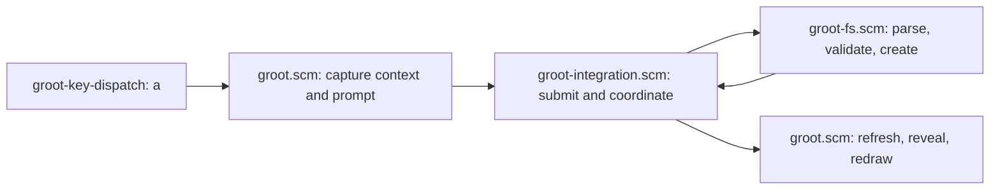

# Directory Operations Specification

## Delivery Scope

- **Unit:** Create one nested file or directory path through the existing `a` action.
- **Includes:** Capture the current create destination before the prompt opens.
- **Includes:** Create missing parent directories beneath the captured destination.
- **Includes:** Create an empty final file when input has no trailing separator.
- **Includes:** Create a final directory when input has one trailing separator.
- **Includes:** Refresh the tree and select the final visible entry.
- **Includes:** Preserve existing directory rename behavior.

## 1. User Interface

### 1.1 `UI-001` — Nested creation prompt

- **Mock:** [ui.html#ui-001](ui.html#ui-001)
- **States:** Empty input, file path, directory path, host error, and narrow label.
- **States:** Creation runs synchronously and has no loading state.
- **Inputs:** `a` opens the prompt from focused tree navigation.
- **Inputs:** `Enter` submits the complete path.
- **Inputs:** `Escape` or `Ctrl-C` cancels without mutation.
- **Inputs:** Native prompt keys edit the submitted path.

## 2. Functional Requirements

- **FR-001** — Groot must open UI-001 when `a` runs from focused tree navigation.
  - UI: UI-001.
  - Verification: Press `a` in tree navigation and verify that the native prompt opens with empty input.
  - Source: Repository behavior and approved UI gate.

- **FR-002** — Groot must capture the create destination before UI-001 receives input.
  - UI: UI-001.
  - Verification: Change selection while the prompt owns focus and verify that creation uses the captured destination.
  - Source: Validated intent and existing create behavior.

- **FR-003** — Groot must interpret one leading separator as relative to the captured destination.
  - UI: UI-001.
  - Verification: Submit `/one/two` and verify that Groot creates `one/two` beneath the captured destination.
  - Source: User decision.

- **FR-004** — Groot must reject empty effective paths, repeated separators, dot components, parent components, NUL, and unsupported Windows path syntax.
  - UI: UI-001.
  - Verification: Submit each invalid form and verify that Groot creates nothing and reports an error.
  - Source: User decisions and repository safety behavior.

- **FR-005** — Groot must create missing intermediate directories and reuse existing real intermediate directories.
  - UI: UI-001.
  - Verification: Submit a path containing existing and missing directories and verify the final path structure.
  - Source: User decisions.

- **FR-006** — Groot must reject an intermediate file, symbolic link, or special entry.
  - UI: UI-001.
  - Verification: Place each entry kind in the path and verify failure before Groot descends through it.
  - Source: Approved requirements inference from repository safety behavior.

- **FR-007** — Input without a trailing separator must create one exclusive empty final file.
  - UI: UI-001.
  - Verification: Submit `one/file.md` and verify an empty file exists without replacing an occupied final entry.
  - Source: User clarification and existing exclusive file creation.

- **FR-008** — Input with one trailing separator must create the final directory after a best-effort collision check.
  - UI: UI-001.
  - Verification: Submit `one/directory/` and verify a directory exists without replacing an observed final entry.
  - Source: User trailing-separator rule and approved requirements correction.

- **FR-009** — Prompt cancellation must perform no filesystem mutation.
  - UI: UI-001.
  - Verification: Cancel UI-001 and verify that no submitted path component exists.
  - Source: Existing prompt behavior.

- **FR-010** — Groot must refresh and select the final visible entry after filesystem success.
  - UI: UI-001.
  - Verification: Create a visible nested entry and verify refresh, ancestor reveal, selection, and redraw order.
  - Source: Validated intent and existing display behavior.

- **FR-011** — Groot must leave a newly created final directory collapsed.
  - UI: UI-001.
  - Verification: Create a directory and verify that Groot selects it without displaying its children.
  - Source: User decision.

- **FR-012** — Groot must retain created parent directories when a later creation step fails.
  - UI: UI-001.
  - Verification: Inject a final-step failure and verify retained parents, refreshed state, and partial-creation feedback.
  - Source: User decision.

- **FR-013** — Groot must report a display failure without compensating filesystem changes.
  - UI: UI-001.
  - Verification: Create an ignored path and verify truthful feedback without deleting the created entry.
  - Source: Approved HLD and existing display behavior.

## 3. Non-Functional Requirements

- **NFR-001** (Security) — Creation must remain beneath the canonical destination captured before the prompt opens.
  - Verification: Test traversal, changed destination, and outside-link paths; verify rejection before final creation.
  - Source: Validated intent and approved HLD.

- **NFR-002** (Data protection) — Creation must never replace an observed existing filesystem entry.
  - Verification: Test final files, directories, links, and special entries; verify that every entry remains unchanged.
  - Source: Repository behavior and approved requirements correction.

- **NFR-003** (Security) — Groot must never follow a symbolic link while traversing submitted components.
  - Verification: Test live and dangling intermediate links; verify rejection and unchanged referents.
  - Source: Approved requirements inference and HLD.

- **NFR-004** (Portability) — `/` must separate prompt components on all platforms, and Windows must also accept `\`.
  - Verification: Run parser checks with POSIX and Windows modes and verify equivalent component results.
  - Source: User decision.

- **NFR-005** (Compatibility) — Existing single-file creation and directory rename behavior must remain available.
  - Verification: Run existing file creation and directory rename checks without changed observable outcomes.
  - Source: Validated intent and repository evidence.

- **NFR-006** (Observability) — Every rejected or partial creation must produce actionable host feedback.
  - Verification: Trigger validation, native, partial, and display failures; verify that each message identifies its outcome.
  - Source: Approved requirements inference and existing host feedback behavior.

- **NFR-007** (Concurrency) — Directory collision detection must remain best effort during concurrent filesystem changes.
  - Verification: Simulate a concurrent final-directory winner and verify that Groot never replaces that directory.
  - Source: Approved requirements correction and current Steel capability.

- **NFR-008** (Accessibility) — UI-001 must retain native keyboard editing and cancellation controls.
  - Verification: Complete and cancel creation using only keyboard input.
  - Source: Existing native prompt behavior and approved UI gate.

## 4. Architecture

**Architecture decisions:**

- Keep `a` as the only create trigger. One trailing separator selects the final directory type.
- Use generic `Create in …:` prompt text. This text supports both final entry types.
- Parse creation syntax authoritatively in `groot-fs.scm`. Do not widen rename or deletion name validation.
- Capture the lexical destination and canonical anchor before opening the prompt. Revalidate the anchor before mutation.
- Traverse components sequentially. Reuse real directories and reject files, links, special entries, and unsafe syntax.
- Use current Steel directory creation with a best-effort collision check. A native binding would improve exclusivity but expand deployment scope.
- Return a small creation result with outcome, final path, detail, and mutation state. Partial creation requires truthful orchestration.
- Refresh after success or partial mutation. Do not roll back created parents.
- Reuse current reveal behavior. Report display failure when filtering prevents selection.
- Add no dependency and no host-runtime change.



**Responsibilities:**

- `groot-core.scm` owns destination selection and generic prompt-label formatting.
- `groot-fs.scm` owns path syntax, containment, entry classification, and filesystem mutation.
- `groot-integration.scm` separates filesystem outcomes from display outcomes.
- `groot.scm` owns Helix input, state refresh, selection, and feedback.
- Tests own parser, filesystem, orchestration, and rename compatibility verification.

**Flow:**

- `groot-key-dispatch` routes `a` only from focused tree navigation.
- `groot.scm` captures the destination context and opens UI-001.
- `groot-integration.scm` submits the captured context and text once.
- `groot-fs.scm` validates all syntax before mutation, then processes each component.
- The filesystem boundary returns one complete outcome after success or failure.
- Integration refreshes after success or possible mutation, then reports the combined outcome.

**Assumptions:**

- Current Steel directory creation cannot prove exclusive ownership during a concurrent directory race.
- Path checks reduce risk but cannot prevent every hostile ancestor-replacement race.
- Ignored entries remain hidden by existing tree filtering.

## 5. Models

### 5.1 `GrootFsCreateContext`

- `destination` is the captured lexical directory path.
- `canonical-destination` is the captured containment anchor.
- The canonical anchor must describe the destination before UI-001 opens.

### 5.2 `GrootFsCreateResult`

- `outcome` is `success`, `rejected`, `native-failure`, or `partial-failure`.
- `path` is the final lexical path when Groot can derive it safely.
- `detail` is false or an actionable error description.
- `mutation-started?` records whether Groot can exclude a mutation-free failure.
- A success result must contain the final lexical path and no error detail.

## 6. Interfaces

### 6.1 Create context capture

```scheme
(groot-fs-capture-create-context destination) → GrootFsCreateContext
```

- **Responsibility and boundary:** Capture lexical and canonical destination facts before prompt input can change selection or filesystem state.

### 6.2 Nested entry creation

```scheme
(groot-fs-create-entry context submitted-path) → GrootFsCreateResult
```

- **Responsibility and boundary:** Validate the complete submission, create components once, and report success, rejection, native failure, or partial failure.

### 6.3 Prompt orchestration

- Preserve the existing injected prompt boundary in `groot-integration.scm:groot-create-prompt-effects!`.
- Adapt its completion boundary to consume `GrootFsCreateResult` without adding retained prompt state.

## 7. Functions

### 7.1 `groot-core.scm`

- **Entry point:** `groot-create-prompt-label`.
- **Behavior:** Render generic create text within existing byte and cell budgets.

### 7.2 `groot-fs.scm`

- **Entry point:** New nested creation boundary implementing the interface in section 6.2.
- **Behavior:** Parse Groot path syntax, revalidate containment, classify components, mutate sequentially, and return one truthful result.

### 7.3 `groot-integration.scm`

- **Entry point:** `groot-create-prompt-effects!` and created-entry display orchestration.
- **Behavior:** Submit once, refresh after possible mutation, preserve document bookkeeping, redraw once, and report combined failures.

### 7.4 `groot.scm`

- **Entry point:** `groot-open-create-prompt!`.
- **Behavior:** Capture context, open UI-001, invoke creation, and connect result handling to tree refresh and reveal.

## 9. Behavior

### 9.1 Submission validation

- **Condition:** UI-001 submits text for a captured create context.
- **Steps:** Validate the complete syntax before filesystem mutation.
- **Steps:** Remove one optional leading separator and detect one optional trailing separator.
- **Steps:** Reject empty components, repeated separators, dot components, parent components, NUL, and unsafe Windows syntax.
- **Result:** Continue with validated components and one final type, or return a mutation-free rejection.

### 9.2 Nested creation

- **Condition:** The filesystem boundary receives validated components and an unchanged destination anchor.
- **Steps:** Revalidate the captured destination and containment anchor.
- **Steps:** Reuse each existing real intermediate directory.
- **Steps:** Create each missing intermediate directory and verify its live kind.
- **Steps:** Reject every intermediate file, link, or special entry.
- **Steps:** Create the final file exclusively, or create the final directory after its best-effort collision check.
- **Result:** Return success with the lexical final path, or return a truthful failure with mutation state.

### 9.3 Display integration

- **Condition:** Creation returns success or indicates possible mutation.
- **Steps:** Clear filesystem caches and refresh the tree.
- **Steps:** Reveal ancestors and select the final visible entry after success.
- **Steps:** Leave a final directory collapsed and preserve editor document bookkeeping.
- **Steps:** Redraw once and report filesystem and display outcomes without compensation.
- **Result:** The tree reflects available filesystem state, or host feedback explains the recovery failure.

## 10. Failure Model

- **F-001** — Submitted syntax is invalid.
  - Detector: The filesystem boundary validates the complete string before mutation.
  - Response: Return rejection and report the invalid path condition.
  - Verification: Submit each invalid form and verify no created component.

- **F-002** — The captured destination changes or becomes unavailable.
  - Detector: Submission-time canonicalization differs from the captured anchor or fails.
  - Response: Return rejection without recreating the destination.
  - Verification: Replace or remove the destination while UI-001 is open and verify rejection.

- **F-003** — An intermediate component has an unsupported live kind.
  - Detector: Strict live classification finds a file, link, or special entry.
  - Response: Stop before descent and preserve every existing entry.
  - Verification: Test each unsupported intermediate kind and verify unchanged contents and referents.

- **F-004** — Native creation fails before Groot creates a parent.
  - Detector: The native operation raises before mutation starts.
  - Response: Return native failure and report its available detail.
  - Verification: Inject the first operation failure and verify a mutation-free result.

- **F-005** — Native creation fails after Groot creates a parent.
  - Detector: The native operation raises after mutation starts.
  - Response: Keep created parents, refresh the tree, and report partial creation without rollback.
  - Verification: Inject a later failure and verify retained parents and refreshed display state.

- **F-006** — Final file or observed directory destination already exists.
  - Detector: Exclusive file creation or final-directory classification detects the collision.
  - Response: Preserve the occupied entry and report rejection or native failure accurately.
  - Verification: Test each occupied final entry kind and verify no replacement.

- **F-007** — Refresh, reveal, or redraw fails after filesystem mutation.
  - Detector: Created-entry display orchestration captures the display error.
  - Response: Preserve the filesystem outcome, avoid compensation, and report the combined failure.
  - Verification: Inject each display failure and verify no filesystem rollback.

## 11. Traceability

- **FR-001** → UI-001 and `groot-key-dispatch`.
- **FR-002** → UI-001, `groot.scm`, and `GrootFsCreateContext`.
- **FR-003** → UI-001 and submission validation.
- **FR-004** → UI-001, submission validation, and F-001.
- **FR-005** → UI-001 and nested creation.
- **FR-006** → UI-001, nested creation, and F-003.
- **FR-007** → UI-001, nested creation, and F-006.
- **FR-008** → UI-001, nested creation, F-006, and NFR-007.
- **FR-009** → UI-001 and prompt orchestration.
- **FR-010** → UI-001 and display integration.
- **FR-011** → UI-001 and display integration.
- **FR-012** → UI-001, `GrootFsCreateResult`, and F-005.
- **FR-013** → UI-001, display integration, and F-007.
- **NFR-001** → `GrootFsCreateContext`, nested creation, and F-002.
- **NFR-002** → nested creation and F-006.
- **NFR-003** → nested creation and F-003.
- **NFR-004** → submission validation.
- **NFR-005** → component responsibilities and compatibility tests.
- **NFR-006** → `GrootFsCreateResult` and the failure model.
- **NFR-007** → directory creation decision and F-006.
- **NFR-008** → UI-001 and prompt orchestration.

## 12. Parked

- Add a separate key, menu, or mode selector for final directory creation.
- Add a native exclusive single-directory creation binding.
- Add handle-relative traversal for stronger hostile-race protection.
- Change directory rename behavior, collision rules, or supported source kinds.
- Add rollback for partially created parent directories.
