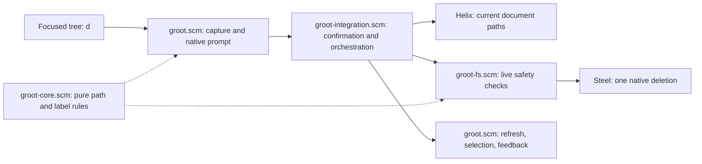

# File Operations: Delete Specification

## Delivery Scope

- **Unit:** Permanently delete one selected entry from tree navigation.
- **Includes:** Files, symbolic links, empty directories, and non-empty directory trees.
- **Includes:** Open confirmation with lowercase `d` and require exact `yes` before deletion.
- **Includes:** Protect the explorer root and reject detected containment, document, and target conflicts.
- **Includes:** Refresh after attempted deletion and report partial or display failures.
- **Includes:** Validate the native backend on Linux first.
- **Excludes:** Change existing create, rename, navigation, search, or document-opening behavior.

The user approved combined file and directory delivery instead of separate entry-kind slices.
The validated intent retains the broader file-operation goals. This specification replaces the previous rename-only delivery specification.
The previous plan becomes stale because its recorded specification hash identifies the rename specification.

## 1. User Interface

### 1.1 `UI-3` — Permanent delete confirmation

- **Mock:** [ui.html#UI-3](ui.html#UI-3).
- **File:** Show `Permanently delete src/main.scm? Type yes:` with empty input.
- **Directory:** Show `Permanently delete src/ and ALL contents? Type yes:` with empty input.
- **Symlink:** Show `Permanently delete link current? Type yes:` with empty input.
- **Editing:** Use native prompt editing and paste controls.
- **Submission:** Enter submits exact lowercase `yes`. No trimming or case conversion occurs.
- **Cancelled:** Empty input, other text, Escape, or Ctrl-C closes without filesystem changes.
- **Narrow:** Shorten the target label while preserving the permanent-deletion warning, directory warning, and usable confirmation input.
- **Insufficient space:** Refuse deletion and report that the editor needs more width.
- **Resize:** Recheck usable width before deletion. Reject submission if the required warning and input no longer fit.
- **Loading:** No separate progress widget exists. Cancellation applies before submission, not during native deletion.
- **Inputs:** Focused tree navigation receives `d`. Native prompt input owns subsequent keys and mouse events.
- **Target:** Capture the path and kind before opening the prompt. Do not retarget during confirmation.

### 1.2 `UI-4` — Delete result

- **Mock:** [ui.html#UI-4](ui.html#UI-4).
- **Success:** Refresh and select the surviving parent without changing editor document focus.
- **Empty parent:** Keep the parent selected after deleting its final child.
- **Missing parent:** Select the nearest surviving ancestor inside the captured root.
- **Unavailable root:** Report the condition and keep a clamped unavailable/root state. Do not create directories.
- **Rejected:** Report root, containment, target, document, and safety-check errors through the host error area.
- **Empty selection:** Open no prompt and make no filesystem changes.
- **Deletion error:** Report the target and available filesystem error details.
- **Partial deletion:** Warn that some contents may already be deleted and no rollback occurred.
- **Display error:** State whether deletion succeeded, then report the refresh or selection problem.
- **Cancelled:** Preserve the previous selection and filesystem contents.
- **Inputs:** Press `R` to refresh or `d` to request a new deletion of the current selection.

The retained UI-1 and UI-2 mocks document rename behavior. They are not part of this delivery scope.

## 2. Functional Requirements

- **FR-1** — Focused tree navigation must request deletion of the selected supported entry when it receives lowercase `d`.
  - UI: UI-3.
  - Verification: Press `d` on each supported entry kind and observe one confirmation prompt.
  - Source: Validated intent keybinding and approved combined scope.
- **FR-2** — Confirmation must identify the captured target and warn that deletion is permanent.
  - UI: UI-3.
  - Verification: Inspect file, link, and directory prompts, including the directory contents warning.
  - Source: Approved requirements and UI gates.
- **FR-3** — Only submission of exact `yes` must authorize deletion.
  - UI: UI-3, UI-4.
  - Verification: Submit `yes`, empty input, `y`, `YES`, and spaced variants; only `yes` reaches deletion checks. Abort also causes no mutation.
  - Source: Approved requirements gate.
- **FR-4** — Confirmed deletion must remove the captured file or symbolic link without deleting a symbolic link's referent.
  - UI: UI-3, UI-4.
  - Verification: Delete files, valid links, and dangling links; check removal and unchanged referent contents.
  - Source: Approved scope and safety clarification.
- **FR-5** — Confirmed directory deletion must remove all contents without recursively following symbolic links.
  - UI: UI-3, UI-4.
  - Verification: Delete nested, hidden, and explorer-excluded entries; linked external sentinel contents remain unchanged.
  - Source: Approved requirements and native backend decision.
- **FR-6** — Deletion must reject the explorer root, detected outside-root targets, missing selections, and unsupported selected entry kinds.
  - UI: UI-4.
  - Verification: Exercise each rejection and observe no native deletion call. Empty selection opens no prompt.
  - Source: Approved requirements and bounded containment clarification.
- **FR-7** — Submission must block detected open-document conflicts for the selected entry or its descendants.
  - UI: UI-4.
  - Verification: Exercise lexical paths, resolved aliases, and link-path prefixes; conflicting requests make no native deletion call.
  - Source: User-selected document protection and approved architecture limitations.
- **FR-8** — Submission must reject missing targets, changed kinds, changed resolved roots or parents, and unresolved safety checks.
  - UI: UI-3, UI-4.
  - Verification: Change captured conditions before submission or inject resolution errors; observe rejection before native deletion.
  - Source: Approved safety clarification and architecture gate.
- **FR-9** — Successful deletion must refresh the tree and select the nearest surviving parent or ancestor within the captured root.
  - UI: UI-4.
  - Verification: Delete the final child and simulate parent disappearance; observe valid ancestor selection and unchanged editor focus.
  - Source: Approved requirements and missing-parent clarification.
- **FR-10** — A native deletion error must prevent further plugin deletion calls and trigger a refresh attempt.
  - UI: UI-4.
  - Verification: Inject a native error after partial removal; observe one native call and a refresh attempt.
  - Source: Approved partial-failure clarification.
- **FR-11** — Error feedback must distinguish rejection, deletion failure, possible partial deletion, and display failure after successful deletion.
  - UI: UI-4.
  - Verification: Inject each outcome and inspect truthful host error messages without false success.
  - Source: Approved requirements gate.
- **FR-12** — Deletion must reject confirmation when its required warning and usable input cannot fit the current display width.
  - UI: UI-3, UI-4.
  - Verification: Test narrow opening and resize before submission; observe an error and no native deletion call.
  - Source: Approved UI and architecture gates.

## 3. Non-Functional Requirements

- **NFR-1** (Data safety) — Cancellation and rejected requests must cause no filesystem changes.
  - Verification: Compare fixture contents and injected deletion-call counts after every cancellation and rejection.
  - Source: Approved requirements gate.
- **NFR-2** (Recovery) — Display failure must not trigger restoration or additional deletion. Recursive deletion must provide no rollback.
  - Verification: Inject display and partial-deletion errors; observe no compensating writes or deletion retries.
  - Source: Approved requirements and safety clarification.
- **NFR-3** (Accessibility) — Confirmation, cancellation, error recovery, and retry must work entirely by keyboard.
  - Verification: Complete each interaction without mouse input.
  - Source: Approved requirements and UI gates.
- **NFR-4** (Compatibility) — Dispatch must preserve existing focus, search, jump, navigation, create, rename, and refresh behavior.
  - Verification: Run dispatch regressions; `d` remains query or jump input in those modes and cannot delete search results.
  - Source: Existing dispatch precedence and approved requirements gate.
- **NFR-5** (Security) — Safety checks must occur before the native deletion boundary, within the approved path-based protection limits.
  - Verification: Inject invalid containment, aliases, kind changes, and resolution failures; observe no native deletion calls.
  - Source: Approved bounded native safety contract.

No numeric limits were proposed. Prompt fit derives from actual label bytes, display cells, input space, and existing host margins.

## 4. Architecture

**Architecture decisions:**

- Preserve existing Scheme layer ownership and native Helix prompt integration. Existing create and rename provide these verification boundaries.
- Capture root, source, kind, and resolved parent before confirmation. Repeat authoritative checks after exact `yes`.
- Use a canonicalized parent plus unchanged basename as the deletion address. Never substitute a selected link's referent.
- Compare lexical paths and resolved entry addresses on component boundaries. Reject detected root, containment, and document conflicts.
- Reject unresolved required safety checks. Do not interpret arbitrary filesystem errors as absence or safety.
- Use `delete-file!` for files and links, and `delete-directory!` for directories. Invoke one native operation without fallback retries.
- Use native recursion instead of filtered explorer traversal. Native recursion includes undisplayed descendants and avoids custom recursive deletion.
- Keep deletion synchronous with the current native prompt flow. Do not introduce workers, background jobs, or progress state.
- Refresh after any native attempt. Preserve document focus and document-sync state while selecting a surviving ancestor.
- Add no dependency, shell command, or host modification. Existing native capabilities satisfy the approved bounded contract.
- Validate the backend on Linux first. Do not claim unverified behavior on other platforms.

A host-native, directory-handle-based interface offers stronger containment controls. It adds host changes, platform backends, deployment coupling, and verification work.
The user approved native reuse with residual external replacement races instead.

**Responsibilities:**

- `groot.scm` owns host input, captured selection, document enumeration, display-width checks, result selection, and host feedback.
- `groot-integration.scm` owns injected confirmation, submission, and result sequencing.
- `groot-fs.scm` and `groot-fs-internal.scm` own authoritative resolution, validation, and native deletion.
- `groot-core.scm` owns pure comparisons and prompt-budget rules.
- Steel owns the filesystem operation. Helix owns prompt editing, document storage, and error presentation.

**Flow:**

1. Route focused tree input and capture the selected entry.
2. Validate capture context and open the native confirmation.
3. Stop without mutation unless submission equals `yes`.
4. Check current width and enumerate current document paths.
5. Repeat containment, kind, captured-resolution, and document checks at the filesystem boundary.
6. Invoke one native deletion operation.
7. Refresh, select a surviving ancestor, preserve document state, and report the actual outcome.

**Approved protection limits:**

- Checks do not bind deletion to the original filesystem object. Same-kind replacement and ancestor replacement races remain possible.
- Canonical paths do not establish inode identity, hard-link equivalence, or a mount boundary.
- Mounted contents are not automatically excluded from recursive deletion.
- Document protection covers string paths exposed by Helix. Its API does not distinguish pathless documents from unrepresentable filesystem paths.
- Permanent deletion means no trash or rollback. It does not promise secure erasure or removal from existing process handles.
- Native recursive symlink protection depends on the host's Rust implementation and platform. Verify the actual supported runtime before release.

**Repository evidence:**

- `groot-fs.scm:groot-fs-live-entry-kind` reads live directory-entry kinds without converting errors into empty trees.
- `groot-fs.scm:groot-fs-read-directory` suppresses read errors for display. Do not use it as a deletion safety probe.
- `groot-core.scm:groot-path-inside?` compares component boundaries; it does not resolve aliases.
- `groot.scm:groot-open-document-paths` already reads current Helix document paths.
- The inspected Helix lockfile selects Steel revision `118fb9f`; its filesystem primitives provide native deletion and canonicalization.
- Steel `delete-directory!` delegates to Rust `remove_dir_all`. Rust documents non-following recursive symlink behavior [1].
- The inspected host uses Rust 1.90.0. Check that version's behavior rather than assuming current documentation matches every deployment [2].

## 6. Interfaces

### 6.1 Existing host interfaces

- `(prompt label callback)` creates an empty native prompt. The callback receives one submitted string.
- `push-component!` displays the prompt. Escape and Ctrl-C abort without invoking submission.
- `editor-all-documents` and `editor-document->path` supply current document identifiers and available string paths.
- `set-error!` displays error feedback.
- Existing area and prompt-budget helpers supply conservative byte and display-cell budgets.

### 6.2 Required filesystem boundary

The new shared deletion boundary accepts captured context and current document paths. Its concrete Scheme representation remains discretionary.

- Captured context contains the logical root, source path, basename, kind, canonical root, and canonical parent.
- All paths are strings. Captured kind is exactly `file`, `directory`, or `symlink`.
- The boundary validates context rather than trusting UI guards.
- Success means the one native operation returned successfully.
- Rejection identifies a pre-operation failure. Native failure identifies a potentially mutated filesystem.
- The result preserves available error details and whether a native operation began.
- Integration consumes this distinction to decide whether refresh is required and which message is truthful.

### 6.3 Native operations

- Existing Steel `canonicalize-path` resolves existing paths and symbolic links.
- Existing Steel `delete-file!` removes one file or link through Rust `remove_file`.
- Existing Steel `delete-directory!` removes a directory tree through Rust `remove_dir_all`.
- These native signatures take one path. Errors propagate to the deletion boundary.
- Never use a canonicalized link referent as the native deletion argument.

## 7. Functions

- `groot-integration.scm:groot-key-dispatch`: Add tree-only delete routing while preserving all existing precedence.
- `groot.scm:groot-handle-event`: Clear pending prefixes and open deletion confirmation for the captured selection.
- `groot-core.scm` prompt helpers: Preserve warning meaning and confirmation input within host byte and cell constraints.
- `groot-fs.scm` deletion responsibility: Validate captured context, resolve conflicts, classify the live entry, and invoke one native operation.
- `groot-integration.scm` deletion responsibility: Separate cancellation, rejection, native outcome, and display outcome.
- `groot.scm:groot-refresh` and `groot-reveal!`: Support refresh and surviving-ancestor selection without retaining changed document-sync state.

Private helper names and decomposition remain implementation choices.

## 9. Behavior

### 9.1 Containment and target validation

1. Require a supported captured kind and a strict lexical descendant of the captured explorer root.
2. Reject traversal components or malformed context instead of normalizing untrusted context into a different target.
3. Resolve the root and selected entry's parent before prompting. Retain these resolved paths.
4. Resolve them again on submission and reject detected changes.
5. Construct the entry address from the resolved parent and unchanged basename.
6. Require the parent and entry address to remain within the resolved root; reject root equality.
7. Read the live kind without following the final link. Require equality with the captured kind.
8. Complete document checks before passing this entry address to the native operation.

A link inside the root can point outside the root. Delete its entry, not its referent.
No sequence of these checks eliminates the approved external replacement races.

### 9.2 Open-document conflicts

1. Enumerate all current document paths exposed as strings by Helix.
2. Check lexical equality and component-boundary descendants before resolving aliases.
3. For a selected regular file, compare existing resolved document referents with the selected entry address.
4. For a selected directory, compare existing resolved document referents with its subtree.
5. For a selected link, compare document-path prefixes by resolved parent plus unchanged basename.
6. Block a document whose pathname uses the selected link directly or as an ancestor.
7. Do not block link deletion solely because an independently named document uses the link's referent.
8. Preserve missing document suffixes when an existing ancestor can be resolved and absence can be established reliably.
9. Reject unresolved required checks, including permission errors and ambiguous dangling-link resolution.

Do not silently discard named missing documents or treat every canonicalization error as absence.
Hard-link identity and unrepresentable document paths remain outside the approved guarantee.

### 9.3 Native deletion and display

1. Invoke the native operation exactly once after validation.
2. Record success or native failure before starting display work.
3. After either native outcome, invalidate tree and search caches affected by deletion.
4. Remove stale expansion state for deleted entries and rebuild the displayed tree.
5. Probe the captured parent and then its ancestors, stopping at the captured root.
6. Select the nearest surviving, displayable ancestor. Do not infer survival from a synthetic root row.
7. Restore prior document-sync bookkeeping and preserve editor document focus.
8. Request redraw and report the recorded filesystem outcome plus any display failure.

Stop plugin deletion calls after a native error. Rust owns internal traversal order and error handling.
If interruption or failure leaves partial contents, recovery consists of inspection and a separately confirmed request. No rollback occurs.

## 10. Failure Model

- **F-1** — Invalid selection or containment.
  - Detector: Capture and authoritative boundary checks.
  - Response: Reject before native deletion; leave an empty selection without a prompt.
  - Verification: Exercise root, outside-root, malformed context, and unsupported entries; verify unchanged fixtures.
- **F-2** — Changed or unresolved target context.
  - Detector: Repeated canonicalization and live-kind lookup.
  - Response: Reject before native deletion and report the failed check.
  - Verification: Replace target kinds, change parent resolution, or inject access errors; verify zero native calls.
- **F-3** — Open-document conflict or unresolved document check.
  - Detector: Lexical, resolved referent, and resolved-prefix comparisons.
  - Response: Reject deletion without modifying documents or filesystem entries.
  - Verification: Exercise direct paths, aliases, missing suffixes, and resolution failures.
- **F-4** — Insufficient confirmation width.
  - Detector: Opening and submission width checks.
  - Response: Report insufficient space without invoking native deletion.
  - Verification: Resize while confirming and inspect mutation-call counts.
- **F-5** — Native deletion error.
  - Detector: Native operation error.
  - Response: Stop further deletion calls, attempt refresh, and warn about possible partial directory removal.
  - Verification: Inject failure after removing a fixture child; verify truthful feedback and retained remaining contents.
- **F-6** — Refresh, ancestor selection, or redraw failure.
  - Detector: Display orchestration and ancestor probes.
  - Response: Preserve the recorded deletion outcome, report display failure, and perform no compensating filesystem operation.
  - Verification: Inject each failure after success and after native error; verify accurate messages and no deletion retry.
- **F-7** — Parent or root disappears externally.
  - Detector: Post-operation ancestor probes.
  - Response: Select a surviving in-root ancestor or report an unavailable root with clamped state.
  - Verification: Remove fixture parents through injected external changes; verify no outside-root selection or directory recreation.

## 11. Traceability

- **FR-1** → UI-3; dispatch and selection capture.
- **FR-2** → UI-3; native prompt labels and captured context.
- **FR-3** → UI-3, UI-4; exact confirmation and cancellation sequencing.
- **FR-4** → UI-3, UI-4; entry-address invariant and native unlink.
- **FR-5** → UI-3, UI-4; native recursive deletion and symlink preservation.
- **FR-6** → UI-4; containment and supported-kind guards.
- **FR-7** → UI-4; current document enumeration and conflict checks.
- **FR-8** → UI-3, UI-4; captured-resolution and live-kind checks.
- **FR-9** → UI-4; refresh, surviving-ancestor selection, and document-state preservation.
- **FR-10** → UI-4; native outcome tracking and failure refresh.
- **FR-11** → UI-4; separate validation, filesystem, and display outcomes.
- **FR-12** → UI-3, UI-4; opening and submission prompt budgets.
- **NFR-1** → Exact confirmation and validation before mutation.
- **NFR-2** → Single native operation and non-compensating display orchestration.
- **NFR-3** → Native keyboard prompt and documented retry controls.
- **NFR-4** → Existing dispatch precedence and regression tests.
- **NFR-5** → Authoritative filesystem boundary and bounded path-based protection.

## 12. Parked

- Copy files and directory trees.
- Cut and paste files and directory trees.
- Create directories.
- Move entries between directories through rename.
- Delete from search results or multiple selections.
- Trash integration, undo, secure erasure, and transactional recursive deletion.
- Host-native protection against hostile concurrent namespace changes.
- Comprehensive hard-link identity and unrepresentable document-path protection.
- Verified deletion backends for platforms other than Linux.
- Separate progress UI and cancellation after native deletion starts.

## Sources

- [1] https://doc.rust-lang.org/std/fs/fn.remove_dir_all.html
- [2] https://doc.rust-lang.org/1.90.0/std/fs/fn.remove_dir_all.html
