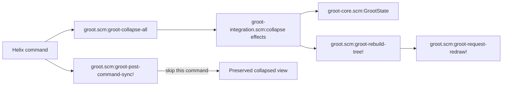

# Groot Collapse All Specification

## Delivery Scope

- **Unit:** Invoke `groot-collapse-all` and restore the active explorer's initial tree view.
- **Includes:** Expose one public Helix command.
- **Includes:** Keep the root open and collapse every directory below it.
- **Includes:** Exit search and reset tree navigation.
- **Includes:** Preserve caches, focus, and document synchronization state.
- **Includes:** Rebuild and redraw the active explorer.
- **Includes:** Do nothing when the explorer is inactive.

## 2. Functional Requirements

- **FR-1** — The active command must keep the root open and collapse every directory below it.
  - Verification: Expand nested directories, invoke the command, and observe only root entries and direct children.
  - Source: Validated intent.

- **FR-2** — The active command must exit search and display tree rows.
  - Verification: Start a search, invoke the command, and observe the root tree without a query.
  - Source: Validated intent.

- **FR-3** — The active command must select the root and reset the viewport.
  - Verification: Invoke the command below the first viewport and observe cursor and window positions equal zero.
  - Source: Validated intent.

- **FR-4** — The active command must rebuild tree rows before scheduling one redraw.
  - Verification: Record command effects and observe rebuild before redraw.
  - Source: Validated intent and repository convention.

- **FR-5** — The command must preserve directory caches and the built search index.
  - Verification: Compare children, files, and search readiness before and after invocation.
  - Source: Validated intent.

- **FR-6** — The command must preserve focus and `last-document`.
  - Verification: Compare focus and `last-document` before and after invocation.
  - Source: Validated intent.

- **FR-7** — Post-command synchronization must skip only `groot-collapse-all`.
  - Verification: Observe no reveal after this command, then observe normal synchronization after another eligible command.
  - Source: Repository evidence and approved intent correction.

- **FR-8** — The inactive command must cause no state change, redraw, or error.
  - Verification: Invoke the command before `groot-open` and observe no callbacks or error.
  - Source: Validated intent and inactive refresh convention.

## 3. Non-Functional Requirements

- **NFR-1** (compatibility) — The existing standalone Steel suite must pass.
  - Verification: Run `steel tests/run.scm` and observe a successful exit.
  - Source: Repository convention.

## 4. Architecture

**Architecture decisions:**

- Export `groot-collapse-all` from `groot.scm`. Exported functions provide the existing Helix command interface.
- Put testable state orchestration in `groot-integration.scm`. Existing integration effects run without Helix.
- Pass existing state, rebuild, and redraw operations into the orchestration function. Add no new abstraction or dependency.
- Reset only transient tree-view fields. Preserve filesystem caches, the built index, focus, and `last-document`.
- Call `groot-rebuild-tree!` before `groot-request-redraw!`. Do not call `groot-refresh` because it clears preserved caches.
- Add one command-name condition to `groot-post-command-sync!`. Keep synchronization unchanged for all other commands.
- The strongest alternative keeps all logic in `groot.scm`. It is shorter but cannot use the standalone test harness.



**Responsibilities:**

- `groot.scm:groot-collapse-all` exposes the Helix command and supplies host callbacks.
- `groot-integration.scm:groot-collapse-all-effects!` guards activity and resets transient view state.
- `groot-core.scm:GrootState` owns tree, search, navigation, and lifecycle fields.
- `groot.scm:groot-rebuild-tree!` materializes rows from the reset expansion state.
- `groot.scm:groot-request-redraw!` schedules the visible update.
- `groot.scm:groot-post-command-sync!` prevents one immediate reveal for this command.

**Flow:**

- Helix resolves `:groot-collapse-all` through the exported Scheme function.
- The command passes current state and host callbacks to the integration effect.
- The effect returns immediately for absent or inactive state.
- The effect resets transient fields, rebuilds rows, and schedules redraw.
- The global post-command hook recognizes this command and skips its immediate synchronization pass.
- Later eligible commands use normal document synchronization.

## 5. Models

### 5.1 `GrootState`

Use the existing structures in `groot-core.scm:GrootState` and its nested state records.

- After active reset, `expanded` contains only the root mapped to `#f`.
- After active reset, search query, results, result count, result rows, and input state match fresh state.
- After active reset, cursor and window equal zero.
- Children, files, search readiness, focus, and `last-document` remain unchanged.

## 6. Interfaces

### 6.1 Public Helix command

```scheme
(provide groot-collapse-all)
(define (groot-collapse-all) ...)
```

- **Responsibility and boundary:** Accept no arguments and restore active Groot view state.

### 6.2 Integration effect

```scheme
(provide groot-collapse-all-effects!)
(define (groot-collapse-all-effects! state rebuild-tree! redraw!) ...)
```

- **Responsibility and boundary:** Mutate only approved state fields, then invoke host callbacks in order.
- Return `'inactive` without effects, or `'collapsed` after successful callbacks.

## 7. Functions

### 7.1 `groot.scm`

- **Entry point:** `groot.scm:groot-collapse-all`.
- **Behavior:** Pass `*groot-state*`, `groot-rebuild-tree!`, and `groot-request-redraw!` to the integration effect.

### 7.2 `groot-integration.scm`

- **Entry point:** `groot-integration.scm:groot-collapse-all-effects!`.
- **Behavior:** Guard activity, reset approved fields, rebuild rows, schedule redraw, and return the internal outcome.

### 7.3 Post-command synchronization

- **Entry point:** `groot.scm:groot-post-command-sync!`.
- **Behavior:** Skip synchronization for normalized name `groot-collapse-all` and preserve existing behavior otherwise.

## 8. Contracts

### 8.1 `groot-collapse-all` command

- **Version:** 1, introduced by this change.
- **Writer:** `groot.scm:groot-collapse-all`.
- **Readers:** Helix command resolution, Groot users, and Helix configuration.
- **Invocation:** `:groot-collapse-all` with no arguments.

**Invariants:**

- Inactive invocation is a no-op.
- Active invocation preserves filesystem contents and cached filesystem data.
- The command creates no keyboard binding.

## 9. Behavior

### 9.1 Active collapse

- **Condition:** Groot state exists and is active.
- **Steps:** Reset expansion, search, cursor, and window state. Rebuild tree rows. Schedule redraw.
- **Result:** The root is selected, direct children remain visible, and deeper directories are collapsed.

### 9.2 Inactive invocation

- **Condition:** Groot state is absent or inactive.
- **Steps:** Return before mutation or callbacks.
- **Result:** State and display remain unchanged.

### 9.3 Post-command synchronization

- **Condition:** The post-command hook receives `groot-collapse-all`.
- **Steps:** Normalize the command name and skip the immediate synchronization call.
- **Result:** The collapsed tree remains visible without changing later synchronization behavior.

## 11. Traceability

- **FR-1** → `GrootState` expansion invariant and active collapse flow.
- **FR-2** → `GrootState` search invariant and active collapse flow.
- **FR-3** → `GrootState` navigation invariant and active collapse flow.
- **FR-4** → Integration effect callback order.
- **FR-5** → `GrootState` preservation invariant.
- **FR-6** → `GrootState` lifecycle preservation invariant.
- **FR-7** → Post-command synchronization flow.
- **FR-8** → Inactive invocation flow.
- **NFR-1** → Standalone integration-effect verification.
